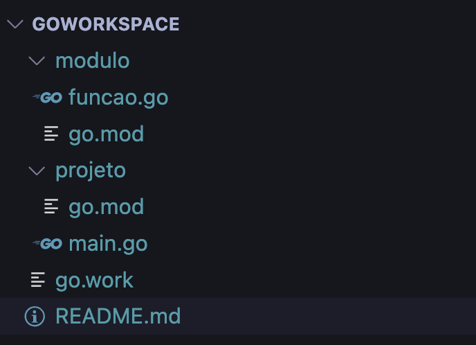

# Go Workspace

Iniciando um projeto Go utilizando Workspace

Crie a estrutura de diretórios conforme desenha abaixo:



```sh
cd modulo
go mod init modulo
```

```sh
cd projeto
go mod init projeto
```

```sh
cd ..
go work init ./projeto ./modulo
```

Programa principal - ./projeto/main.go

```go
package main

import (
	"fmt"
	"modulo"
)

func main() {
   fmt.Println("Somando dois valores...")
   var a int64 = 200
   var b int64 = 150
   c := modulo.Funcao(a, b)
   fmt.Println(c)
}
```

Módulo - Arquivo ./modulo/funcao.go

```go
package modulo

//Funcao soma dois inteiros
func Funcao(a int64, b int64) int64 {
	return a + b
}
```

Execução do programa

```sh
go run ./projeto main.go
```
